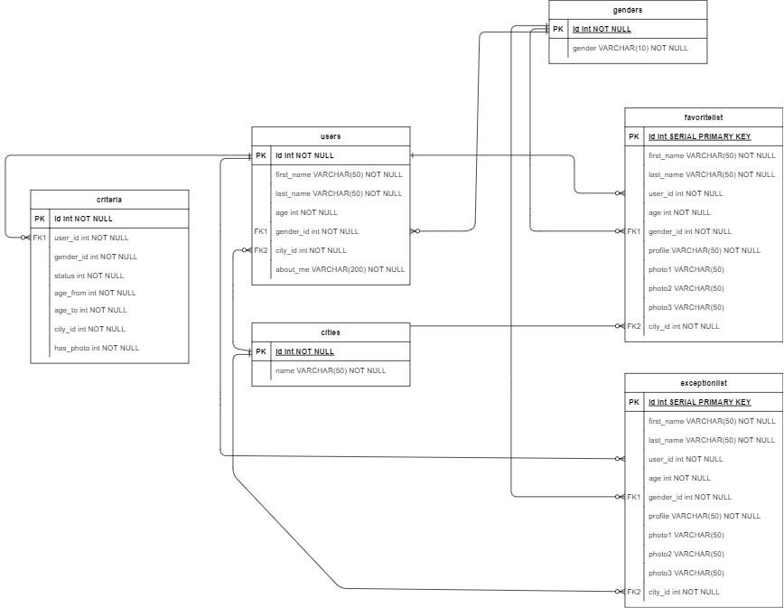

# VK chat\-bot "FindMe"
Бот для знакомств, поиск по возрасту, полу и городу

## Требования
* pip install -r requirement.txt
* создать .env-файл для хранения конфиденциальной информации

## Пример .env-файла
ACCESS_TOKEN="ytrifihjgv" - ключ сообщества  
ACCESS_TOKEN_API="iuyiuyiu" - ключ приложения 
USER_ID="7646534564" 
USER_NAME_DB="postgres" 
USER_PASSWORD_DB=""

## Схема базы данных

## Работа с чатом

